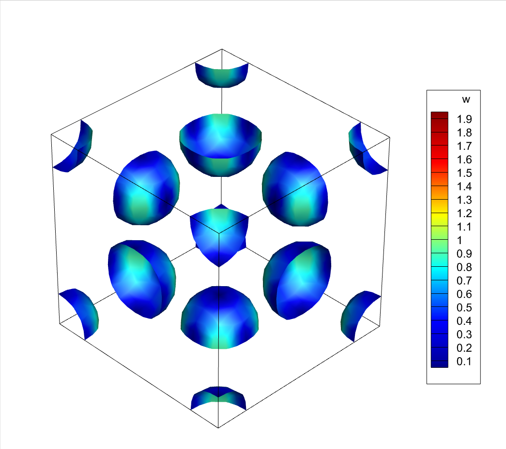

#### 1 Process of exporting data

four steps of creating a TECPLOT file from MATLAB

1. prepare data
2. create file
3. create header
4. create data (zone)

#### 2 Construction of Tecplot file

two parts of tecplot file (.plt)

- header
  - title
  - filetype
  - variables
- data
  - zone
    - block
    - point
  - text
  - ...

#### 3 Test of the code

Taking Taylor-Green flow for example, the testing result (performed at 2022-10-20) is

#### Reference

1. Yang, Y., & Pullin, D. I. (2010). On Lagrangian and vortex-surface fields for flows with Taylor–Green and Kida–Pelz initial conditions. *Journal of Fluid Mechanics*, *661*, 446–481. https://doi.org/10.1017/S0022112010003125
2. https://blog.csdn.net/weixin_42943114/article/details/104204172, accessed 20 October, 2022

